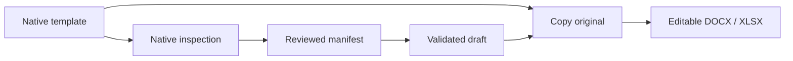

<p align="center">
  
</p>

<p align="center">
  <strong>The local-first AI document compiler that writes into native Office templates—without rebuilding their layout.</strong>
</p>

<p align="center">
  <a href="https://github.com/siriponsri/formora/actions/workflows/ci.yml"></a>
  <a href="LICENSE"></a>
  
  
  
</p>

---

Formora is an open starter kit for building trustworthy document automation for Thai organizations.
Upload a styled `.docx` or `.xlsx`, review its semantic bindings, describe the document you need in
natural Thai, and download a new editable Office file based on a **copy of the original template**.

The layout is never regenerated by an LLM. AI understands and drafts content; deterministic code
performs the native Office mutation after structured validation.

> **POC status:** local developer proof of concept. Formora is not a production approval,
> legal-review, or records-management system. Every generated document requires human review.

## Why Formora

Most document-AI demos flatten an Office file into text, ask a model to recreate it, and lose the
details organizations depend on: page setup, headers, paragraph styles, merged cells, formulas, print
areas, and spacing. Formora uses a different contract:

| Layer | Responsibility | Source of truth |
|---|---|---|
| Semantic IR | What the document means and what content to draft | Validated structured data |
| Template manifest | Exactly where each approved field may be written | Human-reviewed bindings |
| Native layout | How the final document looks and behaves | Original DOCX/XLSX package |



## What works in v0.1

- Local Next.js + FastAPI application with SQLite metadata and filesystem storage.
- Fully offline, deterministic `AI_PROVIDER=mock` golden path.
- Real DOCX inspection: paragraphs, runs, formatting, tables, sections, headers, footers, and OOXML package checksums.
- Split-run placeholder replacement such as `{{bo` + `dy}}`, including tables, headers, and footers.
- Real XLSX inspection: used cells, formulas, merges, dimensions, validations, freeze panes, print areas, and page setup.
- Manifest-driven XLSX cell writes that leave non-target cells alone.
- Optional OpenTyphoon provider behind a validated provider interface.
- Optional local PDF preview through LibreOffice, with graceful fallback when unavailable.
- Synthetic DOCX/XLSX fixtures and property-level preservation tests.
- Beginner-friendly PowerShell setup, developer launcher, doctor, and test scripts.

## Quick start on Windows

### Prerequisites

- Windows 10 or 11
- [Python 3.12+](https://www.python.org/downloads/windows/)
- [Node.js 20.9+](https://nodejs.org/) (current LTS recommended)
- VS Code and PowerShell
- Optional: [LibreOffice](https://www.libreoffice.org/download/download-libreoffice/) for PDF previews

### 1. Clone and open the repository

```powershell
git clone https://github.com/siriponsri/formora.git
cd formora
code .
```

### 2. Run the one-time setup

Open a PowerShell terminal in VS Code:

```powershell
Set-ExecutionPolicy -Scope Process Bypass
.\scripts\setup_windows.ps1
```

The script creates `.venv`, installs both applications, copies `.env.example` to `.env`, initializes
SQLite, and generates safe sample templates. It does not require Docker or an API key.

### 3. Verify and start

```powershell
.\scripts\doctor.ps1
.\scripts\dev.ps1
```

Two terminals open automatically:

- Web app: <http://localhost:3000>
- API documentation: <http://localhost:8000/docs>

## Five-minute demo

1. Open **New template**.
2. Upload `fixtures/sample_internal_memo.docx`.
3. Review the inferred placeholders and save the manifest.
4. Choose **Draft a document** and use the included Thai demo request.
5. Review the structured fields, generate the DOCX, and open it in Word.
6. Confirm that the header, footer, A4 page setup, margins, table, typography, and signature block remain.

The Excel fixture follows the same workflow, with explicit cell bindings edited in the manifest.

## Configuration

Safe defaults in `.env.example`:

```env
AI_PROVIDER=mock
DATA_DIR=./data
DATABASE_URL=sqlite:///./data/app.db
NEXT_PUBLIC_API_URL=http://localhost:8000
```

To test OpenTyphoon later, edit the local `.env` (never commit it):

```env
AI_PROVIDER=typhoon
TYPHOON_API_KEY=your_local_key
TYPHOON_BASE_URL=https://api.opentyphoon.ai/v1
TYPHOON_TEXT_MODEL=typhoon-v2.5-30b-a3b-instruct
```

Formora uses OpenTyphoon's OpenAI-compatible chat-completions interface. Model output is parsed and
validated before it can reach a renderer; malformed JSON fails safely.

## Repository map

```text
formora/
├── apps/
│   ├── api/                 # FastAPI, SQLite, native Office engine, tests
│   └── web/                 # Next.js, TypeScript, Tailwind UI
├── data/                    # Gitignored local templates and generations
├── docs/                    # Architecture, scope, manifest, Codex handoff
├── fixtures/                # Synthetic DOCX/XLSX demo files
├── scripts/                 # Windows setup, run, doctor, tests
└── .github/                 # CI and contribution templates
```

## Test the preservation contract

```powershell
.\scripts\test.ps1
```

The suite verifies that originals are not mutated and checks native properties instead of demanding
byte-identical ZIP archives. Office libraries may legitimately reorder internal package metadata.

## Architecture and extension points

- [Architecture](docs/ARCHITECTURE.md)
- [POC scope and safety boundary](docs/POC_SCOPE.md)
- [Template manifest reference](docs/TEMPLATE_MANIFEST.md)
- [Codex continuation handoff](docs/CODEX_HANDOFF.md)

The current adapters are deliberately small: `AIProvider`, local storage, SQLite repositories, DOCX
and XLSX renderers, and optional LibreOffice preview. Supabase, multi-user authentication, queues,
agent frameworks, and deployment are intentionally absent until the native-format value proof passes.

## Roadmap

- [x] P0 — Local foundation and mock mode
- [x] P1 starter — DOCX upload, inspection, placeholder render, preservation tests
- [x] P3 starter — XLSX inspection, cell render, preservation tests
- [ ] P2 hardening — Typhoon schema repair, prompt evaluation, confidence and review UX
- [ ] P1 hardening — content controls, anchor bindings, overflow diagnostics
- [ ] P4 — OCR for PDF/image evidence (separate from native template preservation)
- [ ] P5 — side-by-side preview and visual regression loop
- [ ] P6 — cloud-readiness only after owner value gates pass

## Contributing

Issues and focused pull requests are welcome. Start with [CONTRIBUTING.md](CONTRIBUTING.md), use only
synthetic fixtures, and include a preservation test with renderer changes. Security-sensitive findings
belong in a private advisory; see [SECURITY.md](SECURITY.md).

## License

[MIT](LICENSE) © 2026 Formora contributors.

