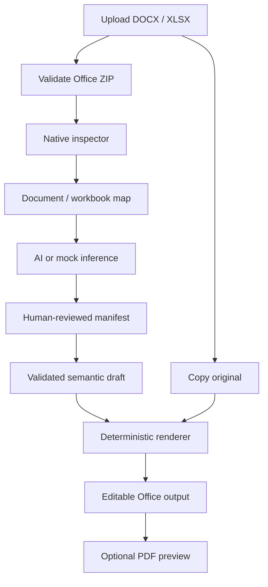

# Architecture

## Core invariant

Every render starts from `COPY(original_template)`. AI never writes to Office files and the uploaded
original is never modified.



## Runtime boundaries

| Component | Responsibility | Must not do |
|---|---|---|
| Next.js web | Upload, review manifest, edit draft, download output | Read local storage directly |
| FastAPI | Enforce API contracts and validation | Expose keys or trust filenames |
| Native inspectors | Build semantic maps from Office packages | Become canonical layout |
| AI provider | Infer fields and draft semantic content | Mutate Office files |
| Renderers | Apply reviewed bindings to a copy | Guess unreviewed locations |
| SQLite | Template/generation metadata | Store Office binary blobs |
| Local filesystem | Originals, manifests, outputs, previews | Use user filenames as internal paths |

## Data lifecycle

```text
data/templates/<template_id>/
  original.docx|xlsx       immutable by convention
  analysis.json            semantic inspection map
  manifest.json            reviewed binding contract

data/generated/<generation_id>.docx|xlsx
data/previews/<generation_id>.pdf
```

The upload staging file is UUID-named under `data/uploads/`. Every application directory is resolved
from the repository root, so launching the API from `apps/api` does not redirect storage unexpectedly.

## DOCX engine

`python-docx` reads common structures. Raw OOXML ZIP parts are listed and high-risk untouched parts
(styles, theme, settings, and media) receive SHA-256 snapshots for preservation tests.

The v0.1 renderer supports explicit placeholders. It searches the main story, tables, nested tables,
headers, and footers. A placeholder split across Word runs is written using the first run's formatting;
overlapping run text is cleared while unrelated prefix and suffix text remain.

## XLSX engine

`openpyxl` inspects formulas with `data_only=False`, layout dimensions, merges, validation summaries,
freeze panes, print settings, and headers/footers. Rendering opens a copied workbook and writes only
cells named in the manifest.

## AI boundary

`MockAIProvider` is deterministic and offline. `TyphoonAIProvider` calls an OpenAI-compatible endpoint
with a low-temperature JSON request. Responses are extracted defensively and validated with Pydantic.
Identity fields such as `template_id` and `file_type` are locked.

## Known preservation boundary

Formora claims property-level preservation, not byte-perfect fidelity. `python-docx` and `openpyxl` can
normalize or discard unsupported extension features when saving. Macro-enabled formats are rejected.
Production support for complex content controls, tracked changes, external links, charts, and advanced
Office extensions requires dedicated fixtures and tests.

